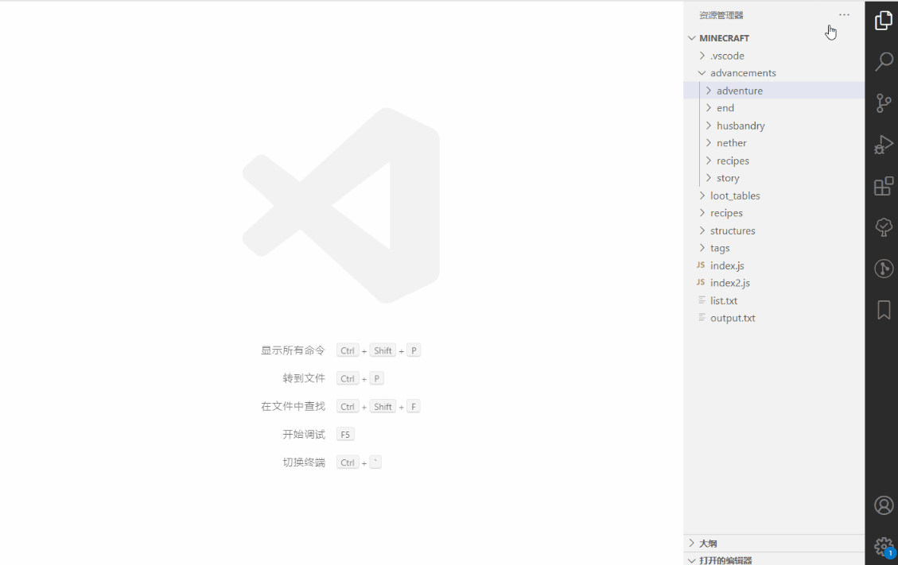

# Minecraft Json Viewer
Minecraft Json Viewer can preview the opened json file's advancements.

## demo

## Usage
- Press Ctrl+P and type ext install Minecraft Json Viewer with a trailing space.
- Press Enter and restart VSCode.
- Open a Json File.
- Choose process from Command Palette or click top right icon.

## Features
support modules
- advancements
